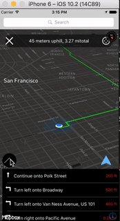

# lazy_walker

The LazyWalker is a mobile application for navigating walking/running routes that are the flattest and involve the fewest hills as possible.

## The Problem

This application was originally suggested as a project for a hackathon at DEV Bootcamp in 2016.  Anyone who has walked around San Francisco has experience with its vast rolling hills - often times I've used GoogleMaps to inquire "how do I get to Union Square from here" or "how do I get to my friend's house from here" and almost everytime, what GoogleMaps doesn't tell you, is that although your destination might be only 0.8 miles away, what isn't clear is that this route might take you up and down several steep inclines while an alternative route - maybe 1.3 miles - will avert all of these hills entirely and is a much preferred route for the average pedestrian who is not desiring an unexpected full-blown cardio workout.

Though the application was not pursued at the time, I found myself building geoLocation-based applications later that year and decided to realize follow through with this project in 2017.

## Stack

The LazyWalker is a native iOS mobile application built in Swift 3 via Xcode 8.1

The LazyWalker makes API calls to Graphhopper (https://www.graphhopper.com/) - a thorough routing and directions API based in Germany.  I have worked with GoogleMaps API, AppleMaps API and countless others and only Graphhopper provided me with the data necessary for this project in its current state.  This application demands not only GeoPoint data for a prospective route from point A to point B, but also a plethora of routing options.  Graphhopper provides 3-9 alternative routes for any given walking/running destination, along with the GeoPoints (latitude/longitude/elevation) for each route option.  Perhaps this application will evolve to make use of a different set of data, but for now the Graphhopper API provides an extensive dataset for any prospective walking voyage.

The LazyWalker also uses Google-Places AutoComplete API (https://developers.google.com/places/web-service/autocomplete) to make the entering of an address ("1130 3rd Avenue, Oakland, CA") or a place ("Golden Gate Bridge") easy for the user to enter and select as a destination quickly.

The LazyWalker uses Mapbox for its custom mapping and annotations (https://www.mapbox.com/).  This is my 3rd application using Mapbox and I am thrilled with their products.  (In a bit of thrilling news Mapbox has partnered with Unity to make 3D A.R. rendering possible https://www.mapbox.com/blog/mapbox-unity/).


## Intro Animations

The LazyWalker makes use of a nifty app logo animation when it is loaded to reveal the mapView with the user's current location.  I have become increasingly familiar with the basic animation capacities of UIKit.  There is a thin line between enhancing the user experience with simple animations and burdening the user experience with excessive animations that take too much time.  Still familiarizing oneself with basic animations increases the developers grasp over manipulating the view structure programatically.

This simple LazyWalker logo intro occurs as follows:

```swift

    func animateLaunch(image: UIImage) {
        
        // CREATE AND APPLY MASK
        
        mask = CALayer()
        mask.contents = image.cgImage
        mask.bounds = CGRect(x: 0, y: 0, width: 128, height: 128)
        mask.anchorPoint = CGPoint(x: 0.5, y: 0.5)
        mask.position = CGPoint(x: mapView.frame.width / 2.0, y: mapView.frame.height / 2.0)
        mapView.layer.mask = mask
        
        animateDecreaseSize()
        
    }
    
    func animateDecreaseSize() {
        
        let decreaseSize = CABasicAnimation(keyPath: "bounds")
        decreaseSize.delegate = self

        // DURATION CAN BE SHORTENED OR VASTLY EXTENDED TO KEEP THE USER IN ANXIOUS SUSPENSE
        decreaseSize.duration = 2.0
        decreaseSize.fromValue = NSValue(cgRect: mask!.bounds)

        // THE RECTANGLE OF THE SHAPE IS DECREASED
        decreaseSize.toValue = NSValue(cgRect: CGRect(x: 0, y: 0, width: 20, height: 20))
        
        decreaseSize.fillMode = kCAFillModeForwards
        decreaseSize.isRemovedOnCompletion = false
        
        mask.add(decreaseSize, forKey: "bounds")
  
    }
    
    func animationDidStop(_ anim: CAAnimation, finished flag: Bool) {
        animateIncreaseSize()
    }
    
    func animateIncreaseSize() {
        
        animation = CABasicAnimation(keyPath: "bounds")
        animation.duration = 2.0
        animation.fromValue = NSValue(cgRect: mask!.bounds)

        // THE RECTANLGLE OF THE SHAPE IS INCREASED TO ESSENTIALLY EXTEND OFF OF THE VIEW REVEALING THE MAP

        animation.toValue = NSValue(cgRect: CGRect(x: 0, y: 0, width: 8000, height: 8000))
        animation.fillMode = kCAFillModeForwards
        animation.isRemovedOnCompletion = false
        
        mask.add(animation, forKey: "bounds")

        UIView.animate(withDuration: 2.0, animations: {
            self.overlay.alpha = 0
            self.logoImageview.alpha = 0
        }) { (true) in

        }
 
    }

```


## Search-Bar with Google-Places AutoComplete

Once the user has been dazzled by the intro logo animation he/she will see their current location rendered on the map.

The user can begin typing an address or a place (IE: 'AT&T Park') and easily select the autocompleted destination options from a drop-down table menu.  Once a destination is selected a call to the Graphhopper API will take place and anywhere from 2-5 route options will render for the user.

## Graphhopper API:

A large JSON object is received back from Graphhopper including: 

	* 3-9 alternative paths

	* GeoPoints for each alternative route (latitude/longitude/elevation)

	* Total Distance for each route

	* Ascension (climb) in meters for each segment of each route

	* Directions for each route (step-by-step)


## Assessing the Flattest Route(s)

The individual paths are stored in a large array of arrays locally.  The flattest route is determined by assessing the total ascension values:  The ascension values are placed in an array and sorted to achieve the index of the flattest route, the 2nd flattest route, etc:

```swift

    func flattestRoute() {
        
        // FIRST ASCENSION VALUES ARE SORTED FROM SMALLEST TO LARGEST
        let sortedAscend = ascend.sorted()

        // THE INDEX OF THE ROUTES BASED ON TOTAL ASCENSION VALUES IS ACHIEVED
          let fiveflattest = ascend.index(of: sortedAscend[4])!
          let fourflattest = ascend.index(of: sortedAscend[3])! 
        
    }

```

Once the index of each route with regard to 'flatness' is acheived this index is used to access each path stored locally.

## Drawing the Routes on the Map

Next the GeoPoints of each route are used to create a PolyLine and applied to the map.  Again, the index of each route (flattest, 2nd flattest, etc) is used to access the values for each route and color the polyline (green being flattest, red being most challenging).

For greater accuracy, the GeoPoints for each route are further divided so that each route is represented by a set of GeoPoints that are no more than 40 meters from the next:


```swift

	// ARRAY of a route's GeoPoints is iterated through - 
	// for each route:

	var array = [CLLocationCoordinate2D]  

   for (index, _) in array.enumerated() {
            if index == 0 { continue } // skip first
            self.split(array[index - 1], array[index], id)
        }

        func add(coordinate: CLLocationCoordinate2D, id: String) {
        DispatchQueue.main.async {
            // Unowned reference to self to prevent retain cycle
            
            let point = pathAnnotation()
            point.coordinate = coordinate
            point.title = id
            //            point.subtitle = "\(coordinate.latitude) / \(coordinate.longitude)"
            self.mapView.addAnnotation(point)
        }
    }
    
    func split(_ from: CLLocationCoordinate2D, _ to: CLLocationCoordinate2D, _ id: String) {
       
        if distance(from, to) > 40 { // THRESHOLD is 200m
            let middle = mid(from, to)
            add(coordinate: middle, id: id)
            split(from, middle, id)
            split(middle, to, id)
        }
        add(coordinate: from, id: id)
        add(coordinate: to, id: id)

    }


```

Notice that in these functions, like many throughout the application, the index (for each route - as achieved by assessing the total ascension) is passed from one function to the next for reference.  This is a clean, simple and fast way to maintain the path data for each route received from Graphhopper locally and use it to draw PolyLines on the map and offer route data to the user.

Once the GeoPoints have been broken down into smaller points the polylines are drawn on the map:


Another reason why I broke up the GeoPoints into a larger set of GeoPoints separated by less than 40 meters was to achieve 'tap-able' annotations.  PolyLines themselves are not 'tap-able' annotations, but like GoogleMaps mobile rendering, I wanted the user to be able to tap on the polyline to consider the data of the route.

Additionally a retractable menu is animated onto the scene that allows the user to select each alternative route to assess its distance, total ascension, and a graphic representation of the elevation data of the entire route.

## LineChart Graphic 

The LineChart greatly enhances the user experience by providing a visual of the elevations of the route progressively.  To do this I created a data set of CGPoints (x,y coordinate point) for each point of each route.  The X axis of the rendered chart is the distance of the route (point A to point B) and the Y axis constitutes the elevation range of the route itself:


```swift

   // Function to create distance/elevation CGPoints for each step along the way of each route

   func distanceElevation(points: NSArray, id: String) {
        
        var coordAry = [CLLocationCoordinate2D]()
        
        var htAry = [Double]()
        
	        for point in points {
	            
	            let pointAry = point as! NSArray
	            
	            htAry.append(pointAry[2] as! Double)
	            
	            let coordinates = CLLocationCoordinate2D(latitude: pointAry[1] as! CLLocationDegrees, longitude: pointAry[0] as! CLLocationDegrees)
	            
	            coordAry.append(coordinates)
	        }
        
        var distanceCounter = 0.0
        
	        for (index, _) in coordAry.enumerated() {
	            
	            if index == 0 { continue } // skip first
	            
	            
		            let distance = self.distance(coordAry[index - 1], coordAry[index])
		            distanceCounter += distance
		            let point = CGPoint(x: distanceCounter, y: htAry[index])
	            
			            if id == "0" {
			                firstCoords.append(point)
			            }
			            if id == "1" {
			                secondCoords.append(point)
			            }
			            if id == "2" {
			                thirdCoords.append(point)
			            }
			            
			            if id == "3" {
			                fourthCoords.append(point)
			            }
			            
			            if id == "4" {
			                fifthCoords.append(point)
			            }
	            
	            }
	        }


```

Once the CGPoints are realized from the dataset, illustrating the distance/elevation data set onto a subview to represent the 'flattness' of each walking route to the user is achieved:


```swift
  func addGraphicSubview(index: String) {
        
        // INDEX OF THE PATH BASED ON THE CALL
        let indexString = index

        let num = Int(index)!
        var pointsAry = [CGPoint]()
        
        // LINECHART IS CREATED
        
        // AXIS' ARE RESET:
        var customView = LineChart()
        customView.data = nil
        customView.xMin = 0.0
        customView.xMax = 0.0
        customView.yMin = 0.0
        customView.yMax = 0.0

        
        //THE CORRESPONDING COLOR IS GIVEN:
        
        var color = UIColor()
        if num == 0 {
            pointsAry = firstCoords
            color = .green
        }
        
        if num == 1 {
            pointsAry = secondCoords
            color = UIColor(red: 127.0/255.0, green: 255.0/255.0, blue: 0.0/255.0, alpha: 1)
        }
        
        if num == 2 {
            pointsAry = thirdCoords
            color = UIColor(red: 255.0/255.0, green: 255.0/255.0, blue: 0.0/255.0, alpha: 1)
        }
        
        if num == 3 {
            pointsAry = fourthCoords
            color = UIColor(red: 255.0/255.0, green: 150.0/255.0, blue: 0.0/255.0, alpha: 1)
        }
        
        if num == 4 {
            pointsAry = fifthCoords
            color = .red
        }
        
        let screenSize: CGRect = UIScreen.main.bounds
        let width = self.view.frame.size.width
        let height = self.view.frame.size.height
        
        customView.frame = CGRect.init(x: 0, y: height - 280, width: screenSize.width - 30, height: 100)
        customView.backgroundColor = UIColor.white.withAlphaComponent(0.2)
        customView.center.x = self.view.center.x
        customView.layer.cornerRadius = customView.frame.size.width / 16

        let xmaximum = pointsAry[pointsAry.count - 1]
        customView.lineColor = color
        customView.showPoints = false
        customView.axisColor = .gray
        customView.axisLineWidth = 1
        
        // THE RANGE OF BOTH THE X AND Y AXIS ARE SET BASED ON THE DISTANCE AND ELEVATION RANGE OF THE PATHS
        customView.yMin = CGFloat(minElevation)
        customView.xMin = 0.0
        customView.xMax = CGFloat(xmaximum.x)
        customView.yMax = CGFloat(maxElevation + 10)
        customView.data = pointsAry
        
        //CHART SUBVIEW IS TAG'D WITH AN ID, LATER USED TO REMOVE IT
        customView.tag = 101
        
        // CHART SUBVIEW IS ADDED TO THE MAP
        self.mapView.addSubview(customView)
        
        
            // SUBVIEW IS GIVEN A TAP GESTURE RECOGNIZER
           // IF THE USER DECIDES TO PERSUE THE SELECTED ROUTE
          //THE USER CAN SIMPLY TAP ON THE SUBVIEW TO MOVE TO THE DIRECTIONS MODE OF THE APPLICATION
        
        
    }

```


## Selecting a Route / Directions Mode

If a user decides to persue a specific route, the user can simply tap on the LineChart graphic and the map will transition to Directions Mode. 

To handle this selection I simply added a tap gesture recognizer to the LineChart subview:


```swift
		let aSelector : Selector = "toDirections"
		         let tapGesture = MyTapGestureRecognizer(target:self, action: #selector(toDirections(withSender:)))
		        tapGesture.id = indexString

		        customView.addGestureRecognizer(tapGesture)
```	

Once the route of choice is selected by the user, all other routes are removed from the mapView and in the vein of the common routing mobile experience, a table of instructions for walking the route is rendered on a table in the lower half of the view.


## Toggle TableView & MenuView

The tableView with directions (just like the menuView) is retractable due to another bit of UIAnimation magic via a toggle button with invokes the following action function:


```swift
    @IBAction func toggleTable(_ sender: UIButton) {
        
        let screenSize: CGRect = UIScreen.main.bounds
        
        if tableDarkView.transform == CGAffineTransform.identity {
            
            UIView.animate(withDuration: 0.8, animations: {
                
                self.tableView.transform = CGAffineTransform(translationX: 0, y: -340)
                
                self.tableDarkView.transform = CGAffineTransform(translationX: 0, y: -340)
                self.tableToggleButton.transform = CGAffineTransform(translationX: 0, y: -340)
                
                //                self.tableToggleButton.transform = CGAffineTransform(translationX: 0, y: -340)
                
            }) { (true) in
                
                //                let image = UIImage(named: "down")
                self.tableToggleButton.setImage( UIImage.init(named: "down"), for: .normal)
                
            }
        } else {
            UIView.animate(withDuration: 0.8, animations: {
                self.tableDarkView.transform = .identity
                self.tableView.transform = .identity
                self.tableToggleButton.transform = .identity
                
                
            }) { (true) in
                self.tableToggleButton.setImage( UIImage.init(named: "up"), for: .normal)
            }
            
        }
    }
```	


## 'GO' mode

Like the current mobile app direction conventions, the LazyWalker allows user to select 'GO' mode which takes the user from the tableView of directions to the real time GO mode including realtime navigation to complete the route.




## Next

In my mind, the natural evolution of this application would be in the direction of a 3D map rendering where the user can not only be provided multiple routes with the elevation data of each but can SEE the elevation values of each route in polylines rendered on a 3D / A.R. rendering.  This is now possible with the merge of Unity and Mapbox so this seems to be the natural next step for this mobile application.

Additionally, while Graphhopper's API is very thorough and efficient, a more comprehensive dataset is achievable.  Ultimately I intend to create an API of my own with comprehensive GeoData for a single place - say San Francisco or Seattle - where the elevation challenges for pedestrians are obvious and such a mobile app can be most useful.


